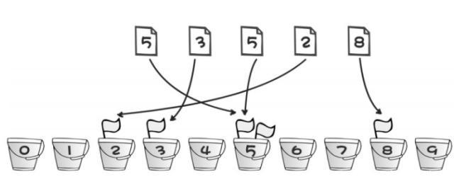
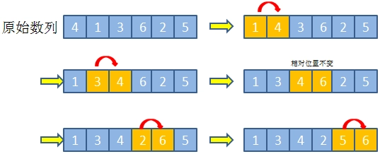
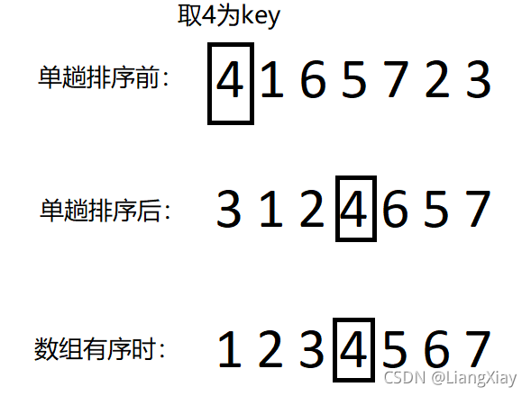

### 桶排序
   

   给定一个能覆盖待排序数组最小到最大值的桶（数组），将待排序数组的值分别放到桶对应下标的位置， 如果待排序存在重复值，则桶对应下标的值加一，输出时，按照桶的下标从小到大输出，如果桶的值大于0，则原数组有值需输出，如果桶的值大于1，则原数组值存在多个，需输出多次
   
   
   **总结**: 把待排序的数组放到已经有顺序的数组中

   **时间复杂度**: O(m+n)

### 冒泡排序
   依次比较两个相邻的元素，如果他们的顺序错误就把他们交换过来
   

### 快速排序
   在一个无序数组中取一个数key，每一趟排序的最终目的是：让key的左边的所有数小于key，key的右边都大于key（假设排升序）。
   
   